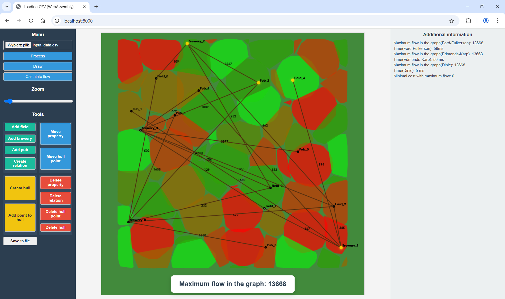

# Problem Description

The task of this project is to plan the logistics of beer transportation in the world of Shire ([project](./project_instruction_eng.md)). 
The main goal was to determine the maximum amount of beer that can be delivered from breweries to pubs, considering the quantity of barley and beer that can be transported between specific intersections. 
The next step involved minimizing road repair costs while maintaining maximum flow. 
Additionally, for each barley field, it was necessary to determine which convex quadrant it belongs to and assign it the appropriate yield. 
The final challenge was to apply algorithms for efficient text pattern searching.

# Running the project

The project consists of two main parts: a web application for visualizing fields, breweries, and pubs in Shire, and a desktop application for text pattern searching.


## 1. Running the web application
  1. Open a terminal and navigate to the project's root directory.
  ```
  cd ProjektAlgII/
  ```
  2. Ensure Emscripten is correctly installed and configured.
  ```
  source ~/emsdk/emsdk_env.sh
  ```
  3. Run the project using the build.py script.
  ```
  python3 build.py
  ```
  4. Open a web browser and go to http://localhost:8000.
  5. Test the features:
    
    - In the web application interface, select the appropriate CSV data file (e.g. input_data.csv from the project repository). Then click the "Przetwórz" (process) button.
    
    - You can use available functions such as "Rysuj" (draw: visualize elements), "Oblicz przepływ" (calculate flow: network flow algorithms) or manually add fields, breweries, pubs, create relations, etc.
    

## 2. Running the desktop application
  1. Open a terminal and navigate to the project's *pattern_searching_and_huffman* directory.
  ```
  cd ProjektAlgII/pattern_searching_and_huffman/
  ```
  2. Make sure PyQt5 for Python is installed.
  3. Run the application using search_gui.py file.
  ```
  python3 search_gui.py
  ```
  4. In the GUI: 

  

  - enter the text pattern to search for,
  - choose the search algorithm (Rabin-Karp, KMP, Boyer-Moore simplified, Boyer-Moore),
  - optionally enable Huffman encoding,
  - select the input CSV file for searching,
  - specify the output file name (default: rk_search.csv for Rabin-Karp, kmp_search.csv for KMP, bm_simplified_search.csv for Boyer-Moore simplified and bm_search.csv for Boyer-Moore),
  - click "Search".


For more information see [documentation](./project_documentation_eng.md).

