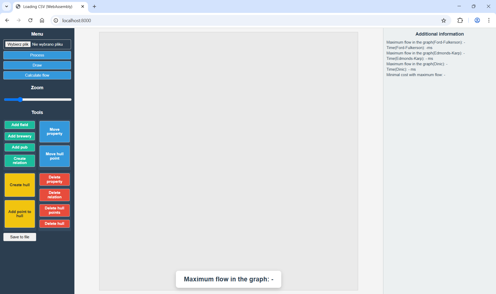
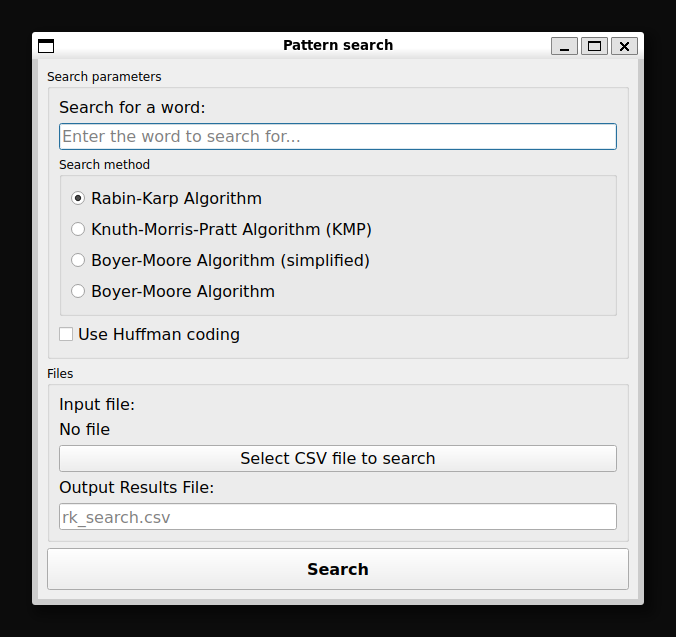

# 1. Problem Description

The task of this project is to plan the logistics of beer transportation in the world of Shire ([project](./project_instruction_eng.md)). 
The main goal was to determine the maximum amount of beer that can be delivered from breweries to pubs, considering the quantity of barley and beer that can be transported between specific intersections. 
The next step involved minimizing road repair costs while maintaining maximum flow. 
Additionally, for each barley field, it was necessary to determine which convex quadrant it belongs to and assign it the appropriate yield. 
The final challenge was to apply algorithms for efficient text pattern searching.

# 2. Solutions to the Problems

The key challenge was to ensure sufficient amount of beer in pubs, which required building a supply chain management system: from barley production in fields, through processing it in breweries, to the distribution of the prepared beer to the pubs.

The main objectives of the project were:

2.1. **Maximizing beer flow**

Determine the largest possible amount of beer that can be delivered from breweries to pubs, considering barley production in fields, breweries' processing capacities, and road capacities for barley and beer.

2.2. **Minimizing road repair costs**

Find a transportation strategy that maintains the maximum possible beer flow while minimizing the costs of repairing damaged roads.

2.3. **Managing field yields**

Accounting for the varying yields of barley fields depending on their location within specific convex “quarters” of Shire.

2.4. **Efficient data searching**

Implementing algorithms to quickly search for keywords such as "beer", "barley", or "brewery", as well as other terms that may be relevant in the future.

The project uses various algorithms to achieve these goals. Formally, the data can be represented as a directed graph $G = (V, E)$ where:
- $V$: the set of vertices representing fields, breweries, and pubs,
- $E \subset V \times V$: the set of roads with capacities $c: E \rightarrow \mathbb{R}^+$ and costs $w: E \rightarrow \mathbb{R}^+$.

The solution includes finding the maximum flow $f: E \rightarrow \mathbb{R}^+$ and then minimizing the road repair costs while maintaining that flow.

## 2.1. Maximum Flow

To determine the maximum amount of beer that can be delivered to pubs (flow from sources – fields, through intermediaries – breweries, to sinks – pubs), two network flow algorithms were used:

- **Edmonds-Karp Algorithm** (`edmondsKarp`): Uses Breadth-First Search (BFS) to find augmenting paths in the residual network.  
- **Dinic's Algorithm** (`dinic`): A more advanced and efficient network flow algorithm, which builds a level graph where each vertex is assigned a level (the shortest distance from the source in terms of edges).

For multiple sources (fields) and sinks (pubs), variants with fictitious super-source and super-sink nodes were applied to reduce the problem to a standard maximum flow problem with a single source and sink.


## 2.2. Cost minimization

To minimize road repair costs while maintaining maximum flow, a cost minimization algorithm was used:

- **Cycle Cancelling Algorithm** (`cycleCancelling`): Used to optimize transportation costs while preserving maximum flow. Iteratively finds and cancels negative-cost cycles in the residual graph, optimizing flow costs without changing its value.

To detect negative-cost cycles in the Cycle Cancelling algorithm, the following algorithm was used:

- **Bellman-Ford Algorithm** (`bellmanFord`): Finds shortest paths in a graph, even the one with negative-weight edges.

## 2.3. Assigning fields to quarters

To implement varying field yields based on their location within convex quadrants, the following approaches were used:

- **Ray Casting Algorithm** (`rayCasting`): Determines whether a given point (representing a barley field) lies inside a convex polygon (representing a Shire quater). This assigns the field to a quadrant and its corresponding barley yield.

- **Graham Scan Algorithm**: Generates convex hulls for point sets. Points belonging to the hulls are stored and can be visualized.

- **Algorytm Jarvisa**: The Jarvis algorithm is also used to generate convex hulls for sets of points.


## 2.4. Text pattern searching

Three pattern-searching algorithms were implemented:

- **Rabin-Karp Algorithm**: Function `rabin_karp(pattern_ready, line, q, huffman_coding)` uses hashing to quickly compare fragments of text. Parameters `q` and `huffman_coding` represent a prime number for hashing and whether to use Huffman encoding, respectively.

- **Knuth-Morris-Pratt Algorithm**: Function `kmp(pattern, text)` minimizes redundant comparisons by using a prefix-suffix table.

- **Boyer-Moore Algorithm**: The algorithm was implemented in two versions: simplified `bm_simplified(pattern, text)` and full `bm(pattern, text)`. Both versions add a prefix ^ (for indexing from 1) and use the function `create_last(text, pattern)`, which creates the LAST array (LAST[x] = position of the last occurrence of x in the pattern, 0 if x does not occur in the pattern). Additionally, the full version uses the function `bmnext(pattern)` to generate the BMNext array (shift control).

- **Huffman Coding**: Optionally used to compress data before searching. If applied, both text and pattern are encoded before searching and decoded before saving results to CSV.

Lines containing the searched word are saved to a CSV file. If Huffman encoding is used, encoded lines are decoded before being saved.


# 3. Project structure

The main part of the project is implemented using object-oriented programming in C++.  
The central element is `Country` class, which manages the entire Shire infrastructure.

All key points in Shire's network are represented by objects inheriting from the `Node` class:

- `Node`: Base class containing common attributes for all nodes, such as `ID` (unique identifier), `xMiddle` and `yMiddle` (coordinates), `radius` (radius), and `name` (object name). IDs are assigned as follows: `ID % 3 == 0` for fields (`Field`), `ID % 3 == 1` for breweries (`Brewery`) i `ID % 3 == 2` for pubs (`Pub`).

- `Field`: Represents barley fields. Inherits from `Node` and includes `production` (barley yield).

- `Brewery`: Represents breweries that process barley into beer. Inherits from `Node` and stores `beerAmount` (produced beer) and `barleyAmount` (processed barley).

- `Pub`: Represents pubs, the destinations for beer transport. Inherits from `Node` and stores basic location information.

- `Intersection`: Represents road intersections. Inherits from `Node`.


Other elements include:

- `Lane`: Represents roads (connections) between two nodes in the network. Contains pointers `from` and `to` indicating the connected nodes. Key attributes are `capacity` (maximum road capacity), `repair_cost` (repair cost), and `flow` (current flow through the road).

- `Country`: The central class managing Shire's logistics.
  - `adjList`: An adjacency list representing the graph.
  - `nodeVector`: A vector storing all nodes in the country.
  - `hulls`: A vector storing `Hull` objects, representing convex quaters of Shire with varying field yields.
  - Methods like `createPub()`, `createBrewery()`, `createField()`, `createIntersection()` create new nodes and add them to the network.
  - `addRelationship()`: Adds roads (`Lane` objects) to the adjacency list.
  - `find()`: A helper method to search for a specific node by its `ID`.
  - `printContent()`: Prints node contents.

- `Hull`: Represents convex hulls, the boundaries of Shire's quaters. Contains `groundClass` (yield for the quadrant) and points defining the convex hull's vertices. Methods include `addPoint()` to add boundary points and `print()` to display hull points.


The `Country.cpp` file implements the previously mentioned algorithms: Edmonds-Karp and Dinic's for maximum flow, Cycle Cancelling for minimizing costs while maintaining maximum flow, Bellman-Ford for detecting negative cycles, and Ray Casting for determining whether a given point is inside a convex polygon.

A Python script was also prepared for data generation, including points used to define convex hulls. Data is saved in CSV format, with columns separated by commas. An example fragment of the data file looks like this:

| Category | ID | Yield (kg) | Processed (kg) | Beer (liters) | X Coordinate | Y Coordinate | Lane From | Lane To | Capacity (kg/liters) | Repair Cost | Ground Class |
| -------- | -- | ----------- | -------------- | ------------- | ------------ | ------------ | --------- | ------- | -------------------- | ----------- | ------------ |
| Field | 0 | 4013 |  |  | -665 | -665 |  |  |  |  |  |
| Field | 3 | 7870 |  |  | 276 | 477 |  |  |  |  |  |
| Field | 6 | 5031 |  |  | 880 | 461 |  |  |  |  |  |
| Brewery | 1 |  | 2509 |  | -905 | 597 |  |  |  |  |  |
| Brewery | 4 |  | 2509 |  | 943 | 821 |  |  |  |  |  |
| Pub | 2 |  |  | 5508 | 568 | -17 |  |  |  |  |  |
| Pub | 5 |  |  | 292 | -880 | -370 |  |  |  |  |  |
| Lane |  |  |  |  |  |  | 0 | 1 | 502 | 0 |  |
| Lane |  |  |  |  |  |  | 3 | 4 | 667 | 0 |  |
| Hull_0 | Array of Points |  |  |  |  |  |  |  |  |  | 6 |
| HullPoint_0 | 0 |  |  |  | 606 | -854 |  |  |  |  | 6 |
| HullPoint_0 | 1 |  |  |  | 628 | -846 |  |  |  |  | 6 |


Files in the `pattern_searching_and_huffman` directory solve the problem of word searching in texts, implementing three algorithms (including one in two variants) and Huffman encoding.

Other files compile the C++ code to WebAssembly for interactive visualization and calculations in a browser.
For visualization purposes in the web interface, the project uses Bézier curves. Implemented in the JavaScript code (Draw.js), they allow drawing connections between nodes in a more complex and aesthetically pleasing way than simple straight lines. The same "pseudo-random" Bézier curves will be generated if the same string is used as the seed.


# 4. Used technologies 

The project combines various technologies to create a versatile application:

- **C++**: Main language for implementing graph algorithms (flow, cost minimization) and complex data structures (`Country`, `Node`, `Lane`, `Brewery`, `Pub`, `Field`, `Hull`).

- **Python**: Used for data generation and building the text pattern-searching application.

- **PyQt5**: Used in Python to create a GUI for the text-searching application.

- **JavaScript**: Web app interface, visualizations (drawing on Shire's map) and interactions with C++ code compiled to WebAssembly.

- **WebAssembly (WASM)**: C++ code is compiled to WebAssembly using **Emscripten**, enabling direct execution in a browser.

- **Node.js HTTP Server**: A simple HTTP server serves the web application files (HTML, JavaScript, CSS, WebAssembly).

- **CSV**: The main format for loading and saving data about buildings (fields, breweries, pubs), relationships (roads), and hulls.


# 5. Running the project

The project consists of two main parts: a web application for visualizing fields, breweries, and pubs in Shire, and a desktop application for text pattern searching.


## 5.1. Running the web application
  1. Open a terminal and navigate to the project's root directory.
  ```
  cd ProjektAlgII/
  ```
  2. Ensure Emscripten is correctly installed and configured.
  ```
  source ~/emsdk/emsdk_env.sh
  ```
  3. Run the project using the build.py script.
  ```
  python3 build.py
  ```
  4. Open a web browser and go to http://localhost:8000.
  5. Test the features:
    
    - In the web application interface, select the appropriate CSV data file (e.g. input_data.csv from the project repository). Then click the "Przetwórz" (process) button.
    
    - You can use available functions such as "Rysuj" (draw: visualize elements), "Oblicz przepływ" (calculate flow: network flow algorithms) or manually add fields, breweries, pubs, create relations, etc.
    

## 5.2. Running the desktop application
  1. Open a terminal and navigate to the project's *pattern_searching_and_huffman* directory.
  ```
  cd ProjektAlgII/pattern_searching_and_huffman/
  ```
  2. Make sure PyQt5 for Python is installed.
  3. Run the application using search_gui.py file.
  ```
  python3 search_gui.py
  ```
  4. In the GUI: 

  

  - enter the text pattern to search for,
  - choose the search algorithm (Rabin-Karp, KMP, Boyer-Moore simplified, Boyer-Moore),
  - optionally enable Huffman encoding,
  - select the input CSV file for searching,
  - specify the output file name (default: rk_search.csv for Rabin-Karp, kmp_search.csv for KMP, bm_simplified_search.csv for Boyer-Moore simplified and bm_search.csv for Boyer-Moore),
  - click "Search".


