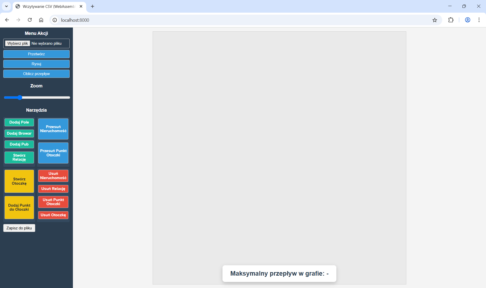
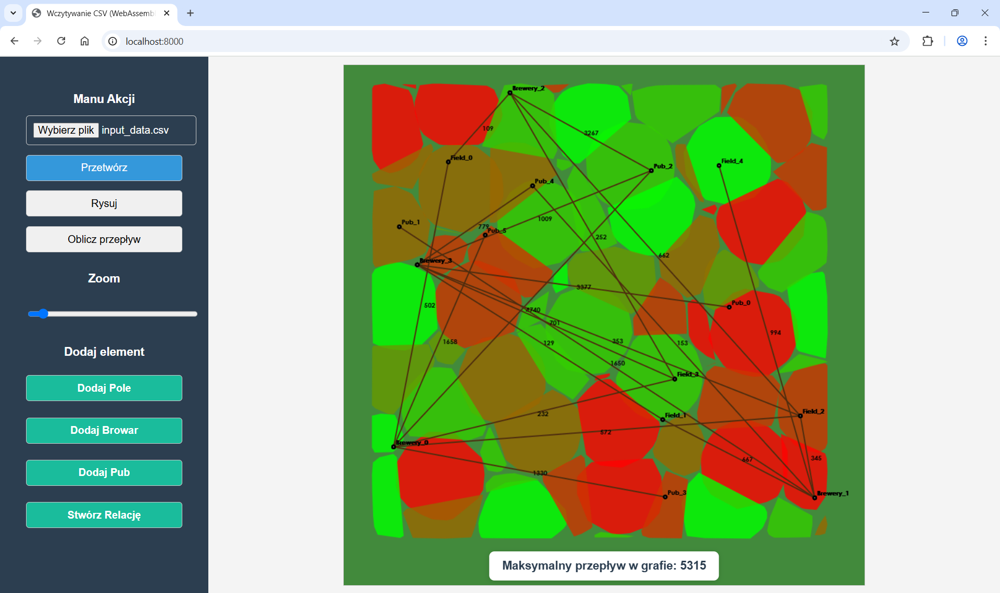
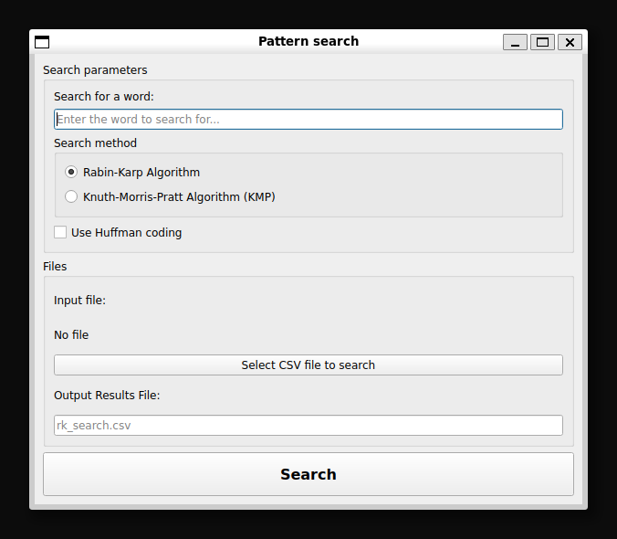

# 1. Opis problemu

Zadaniem projektu jest zaplanowanie logistyki transportu piwa w świecie Shire ([projekt](./project_instruction_pl.md)). 
Głównym celem było wyznaczenie maksymalnej ilości piwa, jaką można dostarczyć z browarów do karczm, biorąc pod uwagę ilość jęczmienia i piwa, którą można przewieźć pomiędzy poszczególnymi skrzyżowaniami. 
W kolejnym kroku należało uwzględnić minimalizację kosztów naprawy dróg przy jednoczesnym zachowaniu maksymalnego przepływu. 
Dodatkowo dla każdego pola jęczmienia należało określić, do której wypukłej ćwiartki należy, a następnie przypisać mu odpowiednią wydajność. 
Ostatnim zagadnieniem było zastosowanie algorytmów umożliwiających efektywne wyszukiwanie słów w tekście.

# 2. Opis rozwiązań problemów

Kluczowym wyzwaniem było zapewnienie dostatku trunku w karczmach, co wymagało stworzenia kompleksowego systemu zarządzania całym łańcuchem dostaw: od uprawy jęczmienia na polach, poprzez jego przetwarzanie w browarach, aż po dystrybucję gotowego piwa do karczm.

Główne cele projektu to:

2.1. **Maksymalizacja przepływu piwa**

Określenie największej możliwej ilości piwa, którą można dostarczyć z browarów do karczm, z uwzględnieniem zarówno produkcji jęczmienia na polach, zdolności przetwórczych browarów, jak i przepustowości dróg dla jęczmienia i piwa.

2.2. **Minimalizacja kosztów napraw dróg**

Znalezienie takiej strategii transportu, która, zachowując maksymalny możliwy przepływ piwa, jednocześnie minimalizuje koszty napraw zniszczonych dróg.

2.3. **Zarządzanie wydajnością pól**

Uwzględnienie zróżnicowanej wydajności pól jęczmienia, która zależy od ich położenia w specyficznych, wypukłych "ćwiartkach" Shire.

2.4. **Efektywne wyszukiwanie danych**

Zaimplementowanie algorytmów pozwalających na szybkie wyszukiwanie w danych słów kluczowych, takich jak "piwo", "jęczmień" czy "browar", a także innych, które mogą być istotne w przyszłości.

Projekt wykorzystuje szereg algorytmów do realizacji założonych celów. Bardziej formalnie, dane mogą zostać przedstawione za pomocą skierowanego grafu $G = (V, E)$, w którym:
- $V$: zbiór wierzchołków odpowiadających polom, browarom i karczmom,
- $E \subset V \times V$: zbiór dróg o przepustowościach $c: E \rightarrow \mathbb{R}^+$ i kosztach $w: E \rightarrow \mathbb{R}^+$.

Rozwiązanie obejmuje znalezienie maksymalnego przepływu $f: E \rightarrow \mathbb{R}^+$, a następnie, przy zachowaniu maksymalego przepływu, zminimalizować koszt naprawy dróg, którymi się poruszamy.

## 2.1. Maksymalny przepływ

Do wyznaczenia maksymalnej ilości piwa, którą można dostarczyć do karczm (przepływ od źródeł - pól, przez pośredników - browary, do ujść - karczm), wykorzystano dwa algorytmy przepływu sieciowego:

- **Algorytm Edmondsa-Karpa** (`edmondsKarp`): Wykorzystuje algorytm przeszukiwania wszerz (BFS) do znajdowania ścieżek powiększających w sieci rezydualnej. 

- **Algorytm Dinica** (`dinic`): Bardziej zaawansowany i wydajny algorytm przepływu sieciowego. Wykorzystuje on graf poziomów (*level graph*), w którym każdemu wierzchołkowi przypisuje się poziom, czyli najkrótszą odległość (w sensie liczby krawędzi) od źródła.

W przypadku wielu źródeł (wiele pól jęczmienia) i wielu ujść (wiele karczm) zastosowano warianty, które tworzą fikcyjne super-źródło i super-ujście, aby sprowadzić problem do standardowego problemu maksymalnego przepływu z jednym źródłem i jednym ujściem.

## 2.2. Minimalizacja kosztów

Aby zminimalizować koszty napraw dróg przy zachowaniu maksymalnego przepływu, zastosowano algorytm minimalizacji kosztów:

- **Johnson's Algorythm** (`mcmf`) w klasie Country implementuje algorytm Minimum Cost Maximum Flow. Algorytm ten jest zaprojektowany w celu określenia maksymalnego możliwego przepływu, który można wysłać przez sieć, zapewniając jednocześnie minimalizację całkowitego kosztu tego przepływu.

## 2.3. Przypisywanie pól do ćwiartek

Dla zaimplementowania zróżnicowanej wydajności pól w zależności od ich położenia w wypukłych ćwiartkach, wykorzystano następujące podejścia:

- **Algorytm Ray Casting** (`rayCasting`): Służy do sprawdzania, czy dany punkt (reprezentujący pole jęczmienia) znajduje się wewnątrz wypukłego wielokąta (reprezentującego ćwiartkę Shire). Pozwala określić, do której ćwiartki należy dane pole, a co za tym idzie, jaka wydajność produkcji jęczmienia powinna zostać mu przypisana.

- **Algorytm Grahama**: Służy do generowania wypukłych otoczek dla zbiorów punktów. Punkty należące do otoczek są przechowywane i mogą być wizualizowane.

- **Algorytm Jarvisa**: Algorytm Jarvisa jest również używany do generowania wypukłych otoczek dla zbiorów punktów.

## 2.4. Wyszukiwanie wzorców tekstowych

W projekcie zaimplementowano trzy algorytmy wyszukiwania wzorców tekstowych:

- **Algorytm Rabina-Karpa**: Funkcja `rabin_karp(pattern_ready, line, q, huffman_coding)` wykorzystuje funkcję skrótu do szybkiego porównywania fragmentów tekstu. Parametry `q` i `huffman_coding` oznaczają odpowiednio liczbę pierwszą dla haszowania oraz informację czy zastosować kodowanie Huffmana.

- **Algorytm Knutha-Morrisa-Pratta**: Funkcja `kmp(pattern, text)` to algorytm wyszukiwania wzorca, który minimalizuje liczbę zbędnych porównań, wykorzystując tablicę prefikso-sufiksów. 

- **Algorytm Boyera-Moore'a**: Algorytm został zaimplementowany w dwóch wersjach: uproszczonej `bm_simplified(pattern, text)` oraz pełnej `bm(pattern, text)`. Obie wersje dodają prefiks ^ (w celu indeksowania od 1) oraz wykorzystują funkcję `create_last(text, pattern)`, która tworzy tablicę LAST (LAST[x] = pozycja ostatniego wystąpienia x we wzorcu, 0 gdy x nie występuje we wzorcu). Dodatkowo, pełna wersja używa funkcji `bmnext(pattern)`, aby wyznaczyć tablicę BMNext (kontrola przesunięć).

- **Kodowanie Huffmana**: Może być opcjonalnie stosowane przed wyszukiwaniem wzorców w celu kompresji danych i optymalizacji pamięci. Jeśli kodowanie Huffmana jest używane, zarówno tekst, jak i wzorzec są najpierw kodowane, a następnie wyszukiwanie odbywa się na skompresowanych danych.

Wiersze zawierające wyszukiwane słowo zapisywane są w pliku CSV. W przypadku zastosowania kodowania Huffmana, wiersze zaszyfrowane podczas wyszukiwania przed zapisem do pliku są odkodowywane.


# 3. Struktura projektu

Główna część projektu została zaprojektowana z wykorzystaniem programowania obiektowego w C++. 
Centralnym elementem jest klasa `Country`, która zarządza całą infrastrukturą Shire.

Wszystkie kluczowe punkty w sieci Shire są reprezentowane przez obiekty dziedziczące po klasie `Node`:

- `Node`: Bazowa klasa zawierająca wspólne atrybuty dla wszystkich węzłów, takie jak `ID` (unikalny identyfikator), `xMiddle` i `yMiddle` (współrzędne), `radius` (promień) oraz `name` (nazwa obiektu). Posiada również metody do pobierania i ustawiania tych wartości, a także do wypisywania informacji. Identyfikatory węzłów są przypisywane w następujący sposób: `ID % 3 == 0` dla pól (`Field`), `ID % 3 == 1` dla browarów (`Brewery`) i `ID % 3 == 2` dla karczm (`Pub`).

- `Field`: Reprezentuje pola jęczmienia. Dziedziczy po `Node` i zawiera informację o `production` (produkcji jęczmienia).

- `Brewery`: Reprezentuje browary, które przetwarzają jęczmień na piwo. Dziedziczy po `Node` i dodatkowo przechowuje `beerAmount` (ilość wyprodukowanego piwa) oraz `barleyAmount` (ilość przetworzonego jęczmienia).

- `Pub`: Reprezentuje karczmy, miejsca docelowe transportu piwa. Dziedziczy po `Node` i przechowuje podstawowe informacje o położeniu.

- `Intersection`: Reprezentuje skrzyżowania dróg. Dziedziczy po `Node`.

Pozostałymi elementami są:

- `Lane`: Klasa reprezentująca drogi (połączenia) między dwoma węzłami w sieci. Posiada wskaźniki `from` i `to` wskazujące na węzły, które łączy dana droga. Kluczowe atrybuty to `capacity` (maksymalna przepustowość drogi), `repair_cost` (koszt naprawy) oraz `flow` (aktualny przepływ przez drogę).

- `Country`: Klasa będąca centralnym punktem zarządzania całą logistyką w Shire.
  - `adjList`: Lista sąsiedztwa, która reprezentuje graf połączeń między wszystkimi węzłami.
  - `nodeVector`: Wektor przechowujący wszystkie węzły w kraju.
  - `hulls`: Wektor przechowujący obiekty `Hull`, które reprezentują wypukłe ćwiartki Shire o zróżnicowanej wydajności pól.
  - `createPub()`, `createBrewery()`, `createField()`, `createIntersection()`: Metody tworzenia obiektów, służą do tworzenia nowych węzłów i dodawania ich do struktury sieci.
  - `addRelationship()`: Odpowiada za dodawanie dróg (obiektów `Lane`) do listy sąsiedztwa.
  - `find()`: Metoda pomocnicza, służąca do wyszukiwania konkretnego węzła na podstawie jego `ID`.
  - `printContent()`: Metoda służąca do wypisywania zawartości węzłów.

- `Hull`: Klasa reprezentująca wypukłe otoczki, czyli granice poszczególnych ćwiartek Shire. Posiada `groundClass` (wydajność dla danej ćwiartki) oraz punkty definiujące wierzchołki otoczki wypukłej. Punkty te wyznaczają granice poszczególnych ćwiartek i są rozłączne z pozostałymi ćwiartkami. Zawiera także metody `addPoint()` do dodawania punktów granicznych i `print()` do wyświetlania punktów otoczki.

Ponadto, w pliku `Country.cpp` zaimplemetowano wcześniej wspomniane algorytmy, czyli algorytm Edmondsa-Karpa i algorytm Dinica dla problemu maksymalnego przepływu, algorytm Cycle Cancelling (anulowania cykli o ujemnym koszcie w sieci rezydualnej) dla problemu znalezienia przepływu o minimalnym koszcie przy zachowaniu maksymalnego przepływu, algorytm Bellmana-Forda do wykrywania ujemnych cykli w grafie, a także algorytm Ray Casting określający czy dany punkt znajduje się wewnątrz wielokąta wypukłego.

Przygotowano także skrypt Pythona przeznaczony do generowania danych, w tym punktów używanych do definiowania wypukłych otoczek. Dane zapisywane są do pliku CSV, a kolejne kolumny rozdzielone są przecinkami. Przykładowy fragment pliku z danymi wygląda następująco:

| Category | ID | Yield (kg) | Processed (kg) | Beer (liters) | X Coordinate | Y Coordinate | Lane From | Lane To | Capacity (kg/liters) | Repair Cost | Ground Class | convRate | Seed |
| -------- | -- | ----------- | -------------- | ------------- | ------------ | ------------ | --------- | ------- | -------------------- | ----------- | ------------ |
| Field | 0 | 4013 |  |  | -665 | -665 |  |  |  |  |  |  |  |
| Field | 3 | 7870 |  |  | 276 | 477 |  |  |  |  |  |  |  |
| Field | 6 | 5031 |  |  | 880 | 461 |  |  |  |  |  |  |  |
| Brewery | 1 |  | 2509 |  | -905 | 597 |  |  |  |  |  |  |  |
| Brewery | 4 |  | 2509 |  | 943 | 821 |  |  |  |  |  |  |  |
| Pub | 2 |  |  | 5508 | 568 | -17 |  |  |  |  |  |  |  |
| Pub | 5 |  |  | 292 | -880 | -370 |  |  |  |  |  |  |  |
| Lane |  |  |  |  |  |  | 0 | 1 | 502 | 0 |  |  |  |
| Lane |  |  |  |  |  |  | 3 | 4 | 667 | 0 |  |  |  |
| Hull_0 | Array of Points |  |  |  |  |  |  |  |  |  | 6 |  |  |
| HullPoint_0 | 0 |  |  |  | 606 | -854 |  |  |  |  | 6 |  |  |
| HullPoint_0 | 1 |  |  |  | 628 | -846 |  |  |  |  | 6 |  |  |
| convRate |  |  |  |  |  |  |  |  |  |  |  | 4 |  |
| Seed |  |  |  |  |  |  |  |  |  |  |  |  | aqVbQm7PPjAkNOyl |


Dodatkowo pliki znajdujące się w katalogu `pattern_searching_and_huffman` rozwiązują problem wyszukiwania słów w tekstach. Zaimplementowene zostały trzy algorytmy (w tym jeden w dwóch wariantach) wyszukiwania wzorca w tekstach, a także kodowanie Huffmana.

Pozostałe pliki odpowiadją za skompilowanie kodu C++ do formatu WebAssembly i udostępnienie go do użytku w przeglądarce, co pozwala na interaktywną wizualizację i obliczenia.
Dla celów wizualizacji w interfejsie webowym, projekt wykorzystuje krzywe Béziera. Zaimplementowane w kodzie JavaScript (`Draw.js`), pozwalają one na rysowanie połączeń między węzłami w sposób bardziej złożony i estetyczny niż proste linie. Te same "pseudo-losowe" krzywe Béziera zostaną wygenerowane, jeśli jako ziarno (`seed`) zostanie użyty ten sam ciąg znaków.


# 4. Wykorzystane technologie

Projekt łączy różne technologie w celu stworzenia wszechstronnej aplikacji:

- **C++**: Główny język do implementacji algorytmów grafowych (przepływ, minimalizacja kosztów) oraz złożonych struktur danych (klasy` Country`, `Node`, `Lane`, `Brewery`, `Pub`, `Field`, `Hull`). 

- **Python**: Wykorzystany do generowania danych oraz do stworzenia aplikacji do wyszukiwania wzorców tekstowych.

- **PyQt5**: Zastosowane w Pythonie do budowy graficznego interfejsu użytkownika (GUI) dla aplikacji do wyszukiwania wzorców tekstowych, zapewniając łatwą interakcję użytkownika z algorytmami.

- **JavaScript**: Używany do interfejsu użytkownika aplikacji webowej, wizualizacji danych (rysowanie na mapie Shire) oraz interakcji z kodem C++ skompilowanym do WebAssembly.

- **WebAssembly (WASM)**: Kod C++ jest kompilowany do formatu WebAssembly za pomocą narzędzia **Emscripten**. Pozwala to na uruchomienie kodu C++ bezpośrednio w przeglądarce.

- **Serwer Node.js**: Prosty serwer HTTP stworzony w Node.js jest używany do serwowania plików aplikacji webowej (HTML, JavaScript, CSS, WebAssembly).

- **CSV**: Pliki CSV są głównym formatem do wczytywania i zapisywania danych dotyczących budynków (pól, browarów, karczm), relacji (dróg) i otoczek.

# 5. Instrukcje uruchomienia

Projekt składa się z dwóch głównych części: aplikacji webowej do wizualizacji pól, browarów i pubów w Shire oraz aplikacji desktopowej do wyszukiwania wzorców tekstowych.

## 5.1. Uruchomienie aplikacji webowej
  1. Otwórz wiersz poleceń (terminal) i przejdź do katalogu głównego projektu.
  ```
  cd ProjektAlgII/
  ```
  2. Należy upewnić się, że Emscripten jest poprawnie zainstalowany i skonfigurowany w zmiennych środowiskowych.
  ```
  source ~/emsdk/emsdk_env.sh
  ```
  3. Uruchom projekt za pomocą skryptu build.py.
  ```
  python3 build.py
  ```
  4. Otwórz przeglądarkę internetową i przejdź pod adres http://localhost:8000.
  5. Testuj aplikację:
    
    - W interfejsie aplikacji webowej wybierz odpowiedni plik danych CSV (np. input_data.csv z repozytorium projektu). Następnie kliknij przycisk "Przetwórz". 
    
    - Możesz korzystać z dostępnych funkcji, takich jak "Rysuj" (wizualizacja elementów), "Oblicz przepływ" (wywołanie algorytmów przepływu sieciowego) lub manualnie dodawać pola, browary, puby, tworzyć relacje, itp.
    

## 5.2. Uruchomienie aplikacji desktopowej
  1. Otwórz wiersz poleceń (terminal) i przejdź do katalogu *pattern_searching_and_huffman* w projekcie.
  ```
  cd ProjektAlgII/pattern_searching_and_huffman/main/
  ```
  2. Do uruchomienia niezbędne jest zaistalowanie biblioteki PyQt5 dla Python. 
  3. Uruchom aplikację za pomocą pliku search_gui.py.
  ```
  python3 search_gui.py
  ```
  4. W interfejsie graficznym aplikacji: 

  

  - wprowadź wzorzec tekstowy, który chcesz wyszukać,
  - wybierz algorytm wyszukiwania, który ma zostać użyty (Rabin-Karp, KMP, Boyer-Moore simplified, Boyer-Moore),
  - aby teksty zostały zakodowane za pomocą algorytmu Huffmana przed wyszukiwaniem, zaznacz opcję użycia kodowania Huffmana,
  - wybierz plik CSV, w którym ma zostać przeprowadzone wyszukiwanie,
  - podaj nazwę pliku wyjściowego, w którym zostaną zapisane wyniki wyszukiwania (domyślnie: rk_search.csv dla Rabina-Karpa, kmp_search.csv dla KMP, bm_simplified_search.csv dla Boyer-Moore simplified oraz bm_search.csv dla Boyera-Moore'a),
  - kliknij przycisk "Search".


